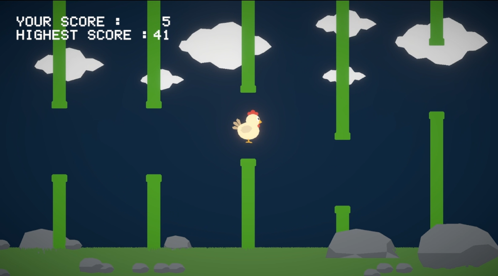
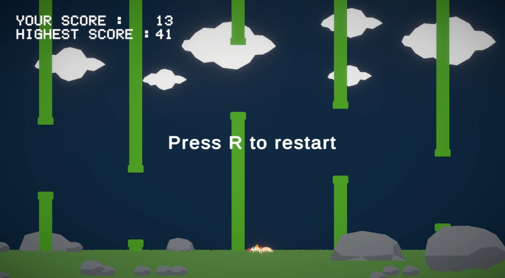

# Flappy Hen

A Flappy Bird-inspired game developed in Unity as a learning project.

## Features
- Custom low-poly hen model
- Procedurally spawned pillars
- Dynamic score and high score system
- Increasing game difficulty
- Background music and sound effects
- Custom low-poly environment (grass, clouds, rocks)
- Restart system

## Controls
Space / W / Up Arrow - Jump
R - Restart after Game Over

## Built With
- Unity 6
- C#
- Blender

## Screenshots

### Gameplay

### Game Over

